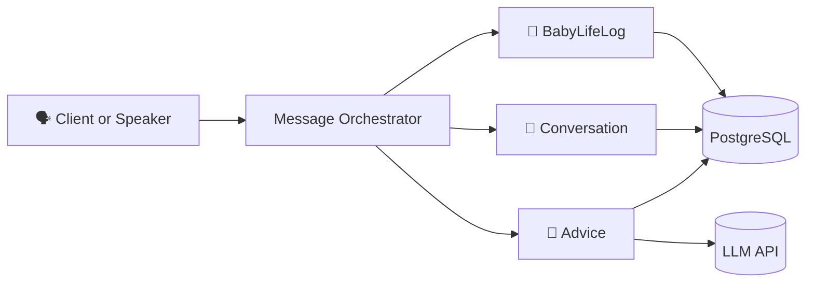

# 🍇 Podo Baby Assistant
아기와의 하루를 자연스럽게 기록하고, 필요한 정보를 대화 형태로 받아볼 수 있는
음성 기반 육아 어시스턴트 프로젝트입니다.

“포도야, 오늘 낮잠 두 번 잤어”
“포도야, 채이 뒤집기 언제 했어?”

이처럼 자연스러운 문장을 받아서 해석하고,
아기의 생활 기록을 자동으로 남기거나 요약을 만들어주는 흐름을 목표로 하고 있습니다.

UI나 계정 시스템 같은 부가 기능보다는
“입력된 문장 → 도메인 처리 → 응답 생성”
이 핵심 파이프라인을 단단하게 만드는 데 집중하고 있습니다.

## 주요 기능 (개발 중)

- 아기 생활 기록 관리 (낮잠, 성장 이벤트 등)
- 기록된 이벤트 조회 및 마일스톤 조회
- 특정 기간(일/주 단위) 요약 생성
- 간단한 육아 조언 응답

## 시스템 구조 (초기 버전)
사용자의 발화(text)는 Message Orchestrator로 들어와  
의도 분석을 거친 뒤 각 도메인 컨텍스트로 분기됩니다.

- Message Orchestrator: 메시지 입력 처리 및 도메인 라우팅
- BabyLifeLog: 아기 이벤트 및 요약 데이터
- Conversation: 대화 기록
- Advice: LLM 기반 조언 및 요약 생성
- PostgreSQL: 공통 저장소
- LLM API: 조언·요약 생성



## 기술 스택 (보완 예정)

### Backend
- Java / Spring Boot 
- Spring Web / Spring Data JPA  
- PostgreSQL
- Python3
- JUnit5 / Mockito / AssertJ  
- Testcontainers (PostgreSQL 통합 테스트)

### Architecture
- Domain Driven Desgin(Hybrid)
- 레이어드 아키텍처 (Application / Domain / Infrastructure)
- Message Orchestrator를 통한 입력 메시지 라우팅
- Swagger / Springdoc 기반 API 문서화 (도입 예정)

### AI / NLP
- Whisper STT (Python Lambda)  
- GPT 기반 LLM API 연동  
- 자연어 기반 이벤트 해석 및 요약 생성  
- Prompt template 분리 및 관리

### Infrastructure & DevOps
- AWS(EC2, S3, RDS, ...)
- Docker / Docker Compose  
- GitHub Actions (CI)  

필요에 따라 스택과 인프라는 계속 확장할 예정입니다.

## 문서 구조

설계와 상세 흐름은 docs/ 디렉토리에서 관리합니다.
```
docs/
├─ overview
├─ usecases
├─ domain
├─ architecture
└─ api
```
